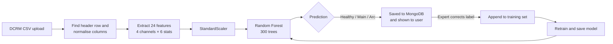

<div align="center">

# ⚡ DCRM Fault Diagnostics Platform

**Upload a circuit-breaker test file and get a fault diagnosis in seconds, with a model that improves every time an expert corrects it.**


[Live demo](#-deployment) · [Features](#-features) · [Quick start](#-quick-start) · [How it works](#-how-it-works) · [API](#-api-reference)

</div>

<!-- Replace with a real screenshot: save it as docs/screenshot-dashboard.png -->


---

## 📖 About

High-voltage circuit breakers are checked with **Dynamic Contact Resistance Measurement (DCRM)**. A test injects current through the breaker contacts while it opens and closes, recording resistance, current, coil current and contact travel thousands of times per second. Reading these curves by eye is slow and needs an experienced engineer.

This platform automates that first diagnosis:

| Condition | What it means |
|-----------|---------------|
| 🟢 **Healthy** | Contacts within normal resistance and timing |
| 🟠 **Main contact wear** | Elevated resistance on the main (current-carrying) contacts |
| 🔴 **Arcing contact wear** | Erosion of the arcing contacts that absorb the switching arc |

Field engineers get an instant answer. When an expert disagrees with a result, they correct it, and the model retrains on the spot (**human-in-the-loop learning**).

## ✨ Features

**For field engineers**
- 🔍 **Instant fault prediction:** drop in a DCRM CSV and get a class plus per-class confidence.
- 📈 **Analysis view:** resistance, current and travel curves side by side.
- 📊 **Graph Plotter:** zoomable, pannable, multi-channel plots of any test file.
- 🗂️ **History and reports:** every prediction is saved, and each one can be downloaded as a report.
- 🆘 **SOS:** raise an urgent issue straight to the admin team.
- 💬 **Interactions:** message colleagues inside the app.
- 🤖 **Field Advisor:** a quick-answer assistant for common DCRM troubleshooting questions.

**For admins**
- 👥 **Employee management:** add or remove users and view each person's prediction activity.
- 🚨 **SOS dashboard:** track and resolve open requests.
- 🧠 **Model retraining:** expert corrections feed straight back into the classifier.

**Everywhere**
- 📱 **Responsive:** works on desktop, tablet and phone (slide-out navigation on mobile).
- ♿ **Accessible:** keyboard focus states, skip link, ARIA labels and reduced-motion support.

## 🧱 Tech stack

| Layer | Technology |
|-------|------------|
| Backend | Python 3.10+, Flask 3 (blueprints), Flask-Login, Flask-Bcrypt |
| Database | MongoDB via PyMongo |
| Machine learning | scikit-learn (Random Forest), NumPy, pandas, joblib |
| Frontend | Jinja2, vanilla JavaScript, Chart.js (+ zoom plugin), CSS custom properties |
| Production | Gunicorn on Render |

## 🧠 How it works



1. **Parsing:** test-set exports differ by vendor, so the parser locates the real header row and normalises odd layouts (e.g. the 407_B format).
2. **Feature extraction:** four channels are used: **coil current, contact travel, DCRM resistance and DCRM current**. Each gives 5 statistics (mean, std, max, min, IQR) plus 1 domain-specific feature:

   | Channel | Extra feature |
   |---------|---------------|
   | Coil current | Time index of the peak |
   | Resistance | Mean resistance while the contacts are closed |
   | Travel | Total contact displacement |
   | Current | Duration of current flow |

3. **Classification:** features are scaled and passed to a 300-tree Random Forest.
4. **Learning loop:** corrections from the Analysis page are appended to the dataset, and the model is retrained and saved immediately.

On first start the model is bootstrapped from the labelled samples in [`data/`](data/).

## 🚀 Quick start

**Prerequisites:** Python 3.10+ and MongoDB, either local ([install](https://www.mongodb.com/try/download/community)) or a free [Atlas](https://www.mongodb.com/atlas) cluster.

```bash
# 1. Clone
git clone https://github.com/shiva-1301/DCRM.git
cd DCRM

# 2. Virtual environment
python -m venv venv
venv\Scripts\activate            # Windows
# source venv/bin/activate       # macOS / Linux

# 3. Dependencies
pip install -r requirements.txt

# 4. Configuration
cp .env.example .env             # Windows: copy .env.example .env
#    then edit .env (see the table below)

# 5. Run
python -m backend.app
```

Open **http://localhost:5000**. On first start the admin account is created from your `DEFAULT_ADMIN_*` settings.

### 🧪 Try it in 60 seconds
1. Log in as the admin and **add an employee** from the admin panel.
2. Log in as that employee and open **Analysis**.
3. Upload any file from [`datasets/`](datasets/) (real tests from breakers 402, 407 and 410) or [`data/`](data/).
4. Review the prediction and curves. If the label looks wrong, pick the correct one to retrain the model.
5. Open **Graph Plotter** to zoom into the raw signals.

### ⚙️ Environment variables

| Variable | Required | Default | Purpose |
|----------|:-------:|---------|---------|
| `MONGODB_URI` | ✅ | `mongodb://localhost:27017/` | MongoDB connection string |
| `MONGODB_DB_NAME` | | `dcrm_system` | Database name |
| `SECRET_KEY` | ✅ in prod | random per start | Signs session cookies. If unset, everyone is logged out on restart |
| `DEFAULT_ADMIN_USERNAME` | | `admin` | First admin's username |
| `DEFAULT_ADMIN_PASSWORD` | ✅ in prod | `admin123` | First admin's password. **Change it** |
| `DEFAULT_ADMIN_EMAIL` | | `admin@dcrm.com` | First admin's email |
| `SESSION_COOKIE_SECURE` | | `false` | Set `true` when served over HTTPS |
| `FLASK_ENV` | | `production` | `development` turns on debug mode |
| `HOST` / `PORT` | | `127.0.0.1` / `5000` | Dev server address |

## 📄 Input file format

The app accepts **`.csv`** exports from DCRM test kits (up to 50 MB). Columns are matched by name, so exact headers can vary, but the file should include:

- `Coil Current C1 (A)`
- `Contact Travel T1 (mm)`
- `DCRM Res CH1 in uOhm`
- `DCRM Current CH1 in Amp`

Metadata rows above the header are fine; the parser skips them. If no matching columns are found, the API returns an error listing the columns it saw.

## 🗂️ Project structure

```
DCRM/
├── backend/
│   ├── app.py              # App factory + dev server entry point
│   ├── config.py           # All settings, read from environment
│   ├── database/           # MongoDB models and queries
│   ├── routes/             # Blueprints: auth, dashboard, admin, prediction, sos, interaction, chatbot
│   ├── services/           # CSV parsing, ML, prediction, retraining, reports
│   └── utils/              # Upload handling and security helpers
├── frontend/
│   ├── templates/          # Jinja2 pages
│   └── static/
│       ├── css/            # style.css (design tokens + layout), dashboard.css
│       └── js/             # Page scripts, sidebar, graph plotter
├── ml/
│   ├── training/           # Offline training script
│   └── utils/              # Feature engineering
├── data/                   # Labelled seed samples + DCRM reference notes
├── datasets/               # Real breaker test files (402, 407, 410)
├── wsgi.py                 # Production entry point: gunicorn wsgi:app
├── render.yaml             # Render deployment blueprint
└── .env.example            # Configuration template
```

Model files (`ml/model/`, `ml/dataset/`) and `uploads/` are generated at runtime and git-ignored.

## 🔌 API reference

All endpoints require a logged-in session.

| Method | Endpoint | Description |
|--------|----------|-------------|
| `POST` | `/api/predict` | Upload a CSV (`file`), returns the prediction and probabilities |
| `POST` | `/api/analyze-csv` | Like predict, plus time-series data for charts |
| `POST` | `/api/plot` | Upload a CSV, returns every channel for plotting |
| `POST` | `/api/retrain` | `{ "filepath", "correct_label": "healthy" \| "main" \| "arc" }` |
| `GET` | `/api/stats` | Model and dataset statistics |
| `GET` | `/api/history` | Retraining history |
| `GET` | `/api/dashboard/analytics` | Current user's prediction breakdown |
| `GET` | `/api/user/reports` | Current user's recent predictions |
| `GET` | `/api/report/download/<id>` | Download a text report |
| `POST` | `/api/sos/create` | `{ "problem_type", "description" }` |
| `POST` | `/api/sos/resolve/<id>` | Resolve an SOS (admin) |
| `POST` | `/api/interactions/send` | `{ "receiver_id", "message" }` |
| `GET` | `/api/interactions/conversation/<user_id>` | Message thread |
| `POST` | `/api/chatbot/ask` | `{ "question" }`, returns a Field Advisor answer |

## 🔐 Security

- Passwords hashed with bcrypt, and sessions in HttpOnly, SameSite=Lax cookies.
- Uploads are restricted to CSV, given sanitised filenames, and isolated in per-upload folders.
- Retraining only accepts files inside the uploads directory (path-traversal safe).
- All user input is length-capped and type-checked server-side.
- Secrets come from environment variables. `.env` is git-ignored.

> ⚠️ Before going public, set a strong `DEFAULT_ADMIN_PASSWORD` and `SECRET_KEY`, and change the admin password after first login.

## ☁️ Deployment

**Live demo:** _add your Render URL here_

The repo includes a [`render.yaml`](render.yaml) blueprint for **Render's free tier**:

1. **Database:** create a free [MongoDB Atlas](https://www.mongodb.com/atlas) cluster. Add a database user, allow network access from `0.0.0.0/0`, and copy the connection string.
2. **Push** this repository to GitHub.
3. On [render.com](https://render.com), choose **New → Blueprint** and pick the repo.
4. When prompted, fill in `MONGODB_URI` and `DEFAULT_ADMIN_PASSWORD`. `SECRET_KEY` is generated for you.
5. Click **Apply**. When the build finishes, paste the `*.onrender.com` URL into the "Live demo" line above.

> **Note:** Render's free disk is ephemeral. Uploaded files and the retrained model reset on redeploy, and the app retrains from `data/` at startup. Users, predictions and SOS records live in MongoDB and persist. Free instances also sleep when idle, so the first request can take ~30 s.

## 🛠️ Troubleshooting

| Problem | Fix |
|---------|-----|
| `ServerSelectionTimeoutError` on start | MongoDB isn't reachable. Start it locally or check `MONGODB_URI` / Atlas network access |
| "No Channel-1 columns found" | The CSV headers don't include the expected DCRM columns (see [Input file format](#-input-file-format)) |
| Logged out after every restart | Set a fixed `SECRET_KEY` in `.env` |
| "No training data found" | Make sure `data/` contains the `*_sample.csv` files |
| `ModuleNotFoundError: backend` | Run from the project root with `python -m backend.app`, not `python backend/app.py` |

## 🗺️ Roadmap

- [ ] CSRF tokens on all forms (Flask-WTF)
- [ ] Persist model artefacts to cloud storage so retraining survives redeploys
- [ ] PDF reports with embedded charts
- [ ] Larger labelled dataset and a model-accuracy dashboard
- [ ] Automated tests and CI

## 🤝 Contributing

1. Fork the repo and create a branch: `git checkout -b feature/my-change`
2. Commit with clear messages: `git commit -m "feat: add X"`
3. Push and open a pull request.

## 👤 Author

**Shiva** · [@shiva-1301](https://github.com/shiva-1301)

Built as a first-year college project and later refactored and modernised.
